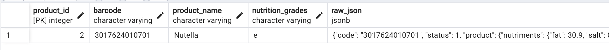
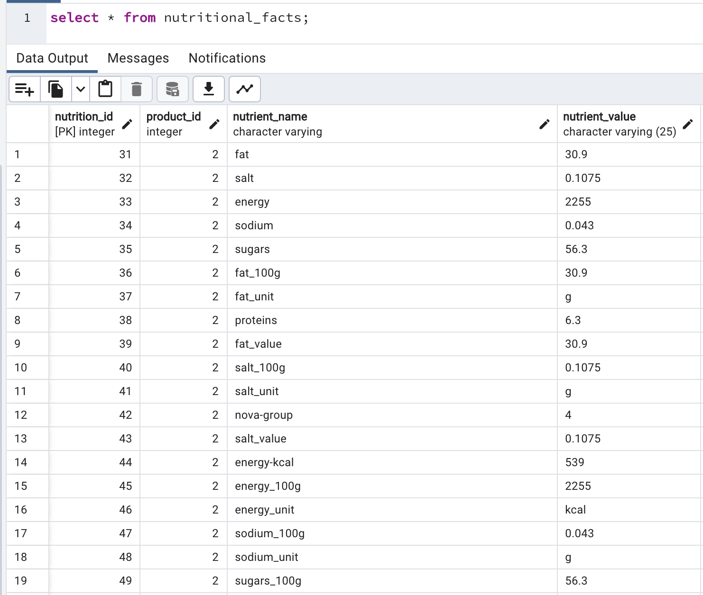

# Open Food Facts API ETL

This project aims to build an ETL to extract, transform and load data from Open Food Facts ETL that contains information about food ingredients. 

## Project Overview

To build this ETL, I first tried to understand what data Open Food Facts contain. To get data, you have to send a request with a barcode of the product to this open source database and it will return information about that product, such as its name, its ingredients, etc. 

First, I sent a basic request with an example barcode. I received a JSON response with the data as specified. 

Then, I set out the goal of creating this ETL that automates the process of working with big amount of data to check and process. I have created a Postgres database that would contain loaded data. But first, I extracted it (it needs a database of barcodes to be checked). Then, I transformed the request from raw file to individual nutrition information that can be used for reporting and analysis. 

## Project Structure

extract.py: Python code responsible for fetching the  JSON from the Open Food Facts API. It sends a request to the API endpoint https://world.openfoodfacts.net/api/v2/product/{barcode}.

transform.py: Python script that cleans, transforms, and prepares the data for loading and saves it to the SQL database.
openfood_etldag.py: The Airflow DAG defining the ETL workflow steps, such as extract transform and load
database_utils: Utils Python script that is used to connect to database (used in other files) and save to database. Since I am using these functions multiple times, I have made this file as a helper.

## Setup

Clone the Repository:

git clone https://github.com/sardorick/korzinka-2

## Install Dependencies:

cd korzinka-2
pip install -r requirements.txt 

Modify Configuration (if needed):

Database Connection: Set up a PostgreSQL connection in the Airflow connections. 
Or you can use the database as set up using a cloud solution (Tendo).

## Running the ETL

Start Airflow: In your project directory, initialize and start the Airflow webserver and scheduler. (airflow webserver & airflow scheduler)

Access Airflow UI: Open the Airflow web interface (typically at http://localhost:8080) and unpause the 'openfood_etl' DAG.

Manually Trigger (optional): If desired, you can manually trigger a DAG run.

This ETL will extract the data from the Open Food Facts API (provided there is a database of barcodes in product_barcodes table, there is currently only one added for dev purposes). Then it transforms and loads it into the table nutritional_facts for each product.

I have chosen to use Airflow for this project as well since it doesn't require paid tier and is the best suited for this ETL pipeline. It will also provide the capabilities of logging, error handling, and monitoring the performance of the pipelines (DAGs).

## Database Table

There are 3 tables in total:
products
product_barcodes
nutritional_facts

Product_barcodes should be a pre-defined table that contain actual barcodes of food that needs to be checked. The pipeline will then access these barcodes depending on if they are already processed or not and then will store the products based on these barcodes in 'products' table. Then the transform part will transform, meaning extracting individual nutritional elements from the raw JSON and store them in the table called 'nutritional_facts'.

## Overall conclusions

Overall conclusion I have derived from the project is that it is quite interesting to automate and manage the process of building such pipelines where the data is handled. It allows the owners of the data to transform to make the data as useful as possible to see it in reporting, analyzing and building machine learning models. We can clean the data and store it as we want. The usage of tools such as Airflow makes the job easier and allows to scale the project. The pipeline should be able to handle big amounts of data and report its performance with monitoring as well.